# Project-Scarlett

A Self-Hosted Alternative to Heroku,Netlify,Railway and Fly.io


Deploying changes

Easy way to deploy changes to  github repository to a server on Firecracker virtual machines running Docker.

## Features

- Deploy any repo to your server by including a docker compose file in root of repo.
- Automatic DNS record creation (Cloudflare DNS) and SSL certificate Management.
- Changes to repo are automatically detected and deployed as per configuration ( Hot-Reload , Re-build , Re-deploy ) .
- Container logs streaming to web-ui.
- Manage Environment Variables from web-ui.
- Forward any port as a http port with custom subdomain . 
- Ability to forward any tcp port for things like SSH .
- Add your SSH public key to directly SSH into the VM .
- Github OAUTH and personal access token (PAT) support.
- Slack,E-mail and Mobile (pushover)  Notifications . 
- Admin pannel to manage and monitor servers and users.
- Designed to be used by a multi-user organisation with github organisation structure mapping .
- Mobile Friendly .
- Dark and Light theme .


## How-to

### This section is a work in progress
Clone this repo,
Install docker,firecracker,socat and create a vm-linux image and alpine linux rootfs ( any distro should work but not tested ) as described here also,install docker and net-tools to rootfs,
[https://github.com/firecracker-microvm/firecracker/blob/main/docs/rootfs-and-kernel-setup.md](https://github.com/firecracker-microvm/firecracker/blob/main/docs/rootfs-and-kernel-setup.md)

Install python packages
Run
```
pip3 install -r requirements.txt

```


To start web-server
```
cd src
gunicorn -w 2 -k gevent "app:create_app()"

```

Also start beat scheduler and periodic task worker

```
celery -A tasks.periodic_tasks beat --loglevel=info
celery -A tasks.periodic_tasks worker --loglevel=info -n periodic

```

For each server start a celery worker with name and queue same as its domain prefix

```
celery -A tasks.remote_tasks worker --loglevel=info -Q de -n de
```

## Servers

Adding Server

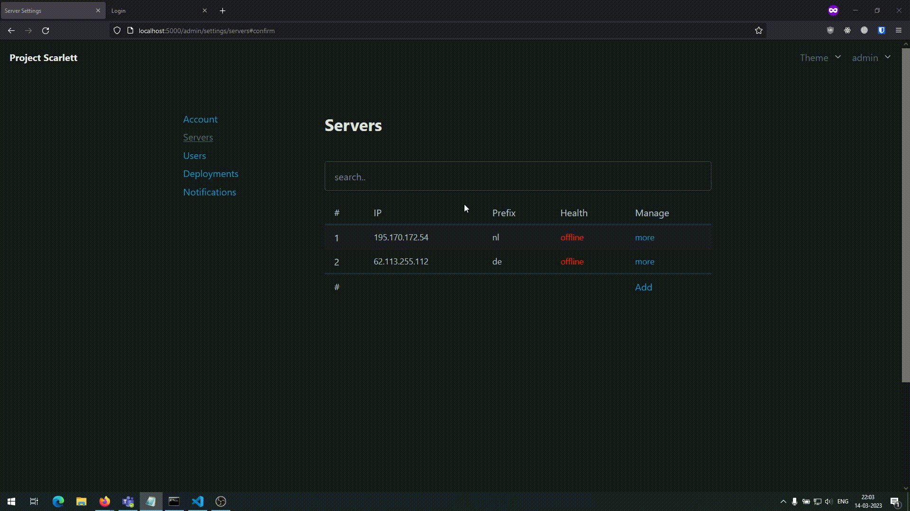

Server Information

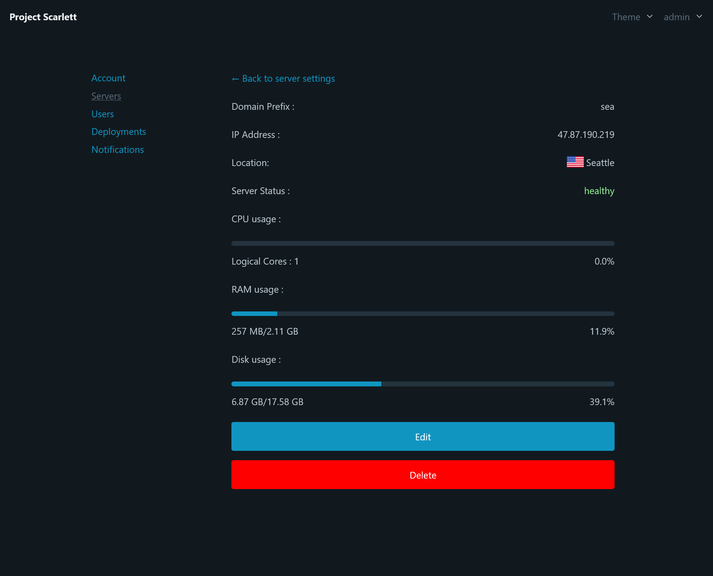
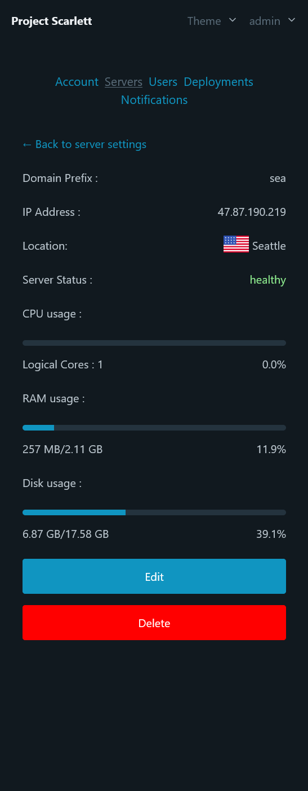


## Deployments 

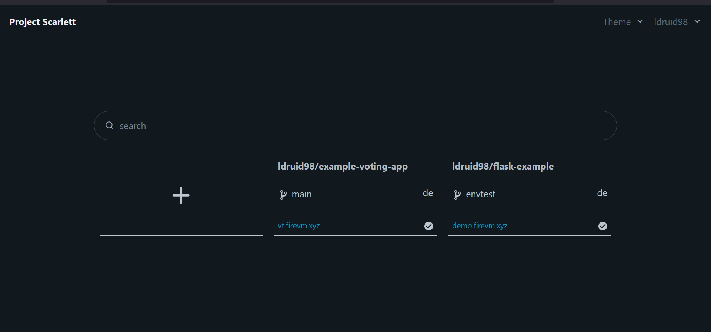
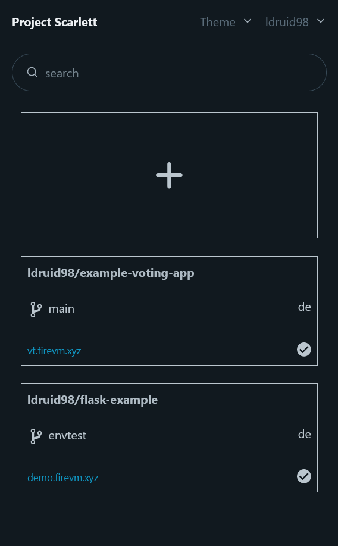
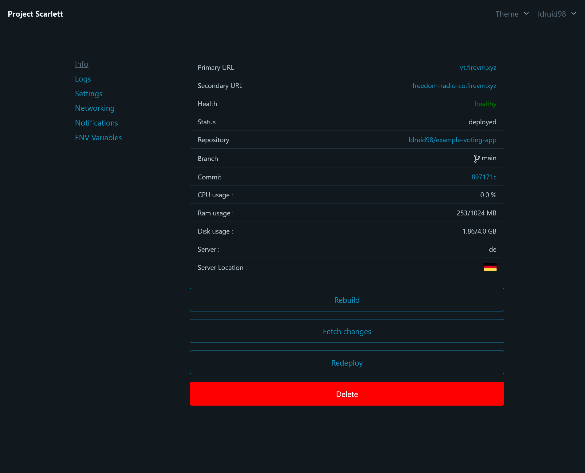
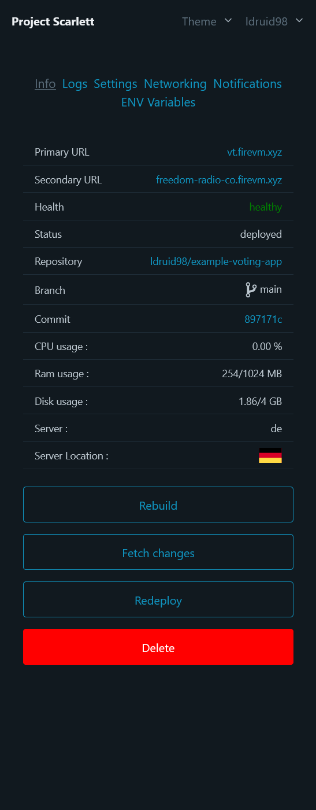

Environment Variables 


Network Forwards 

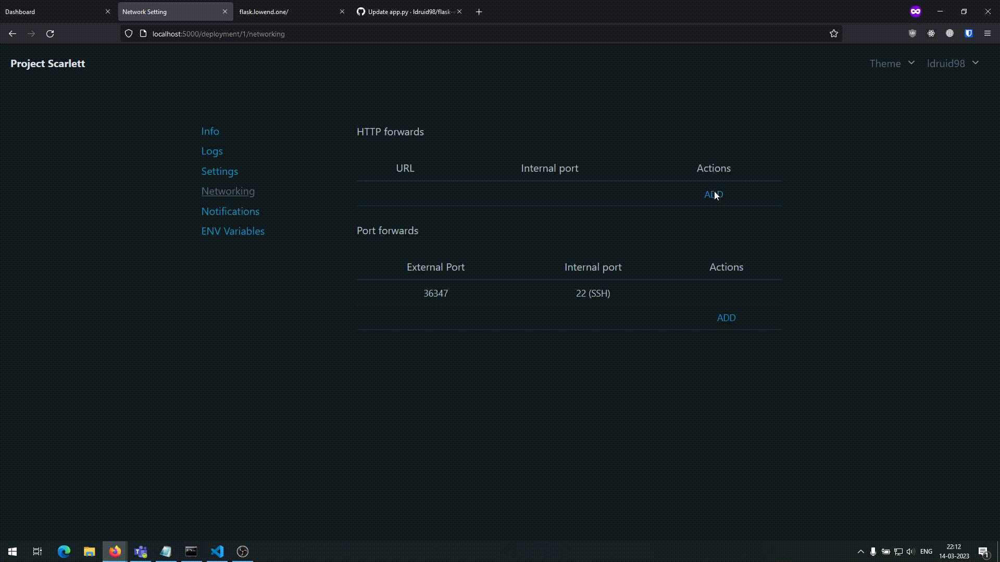

Logs 


Adding SSH public-key 

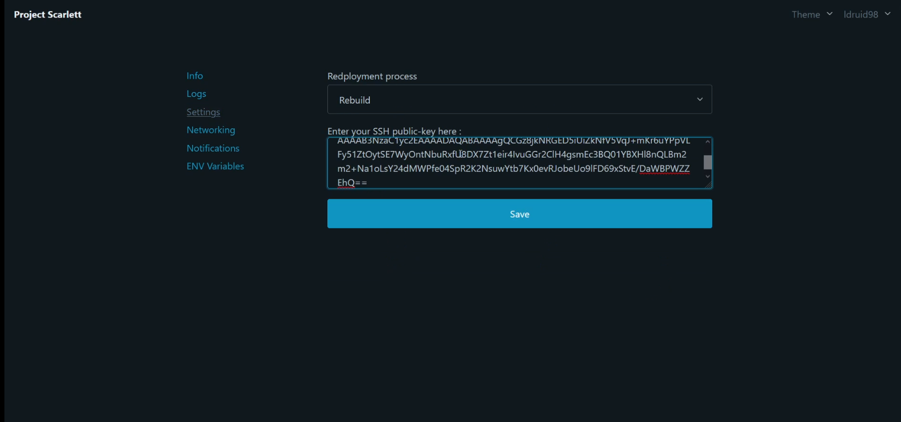


## Admin Pannel 

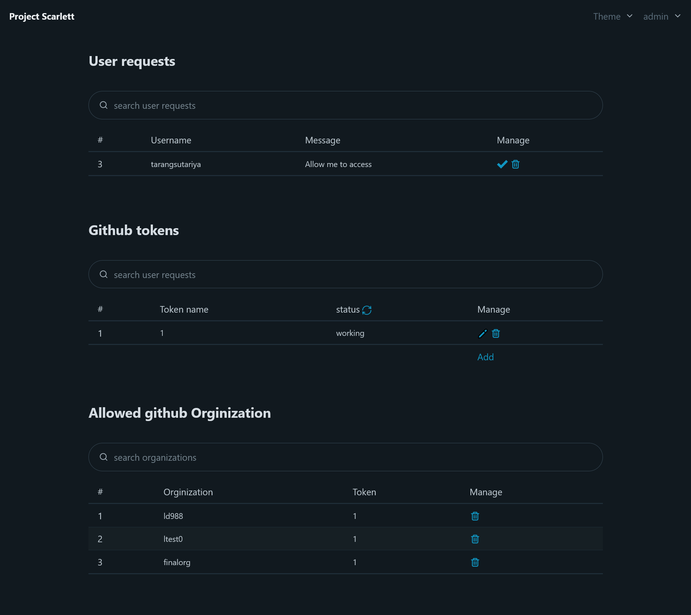
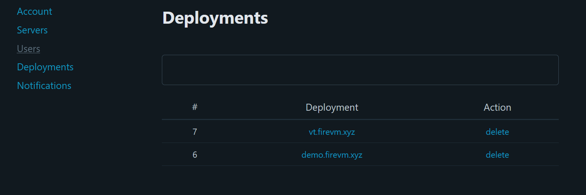
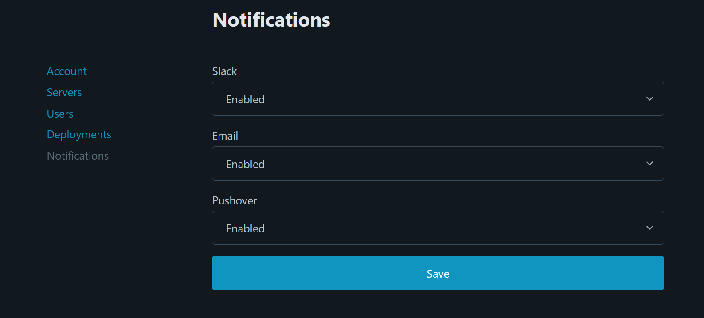
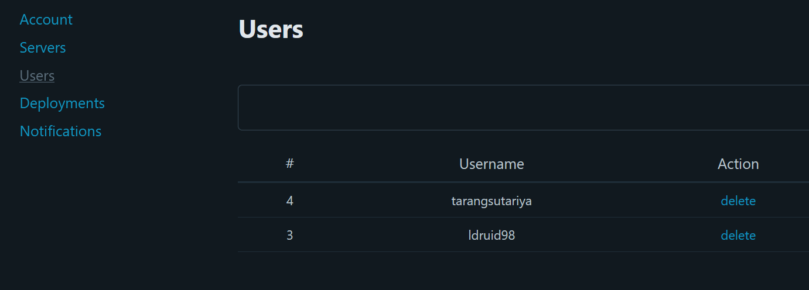


